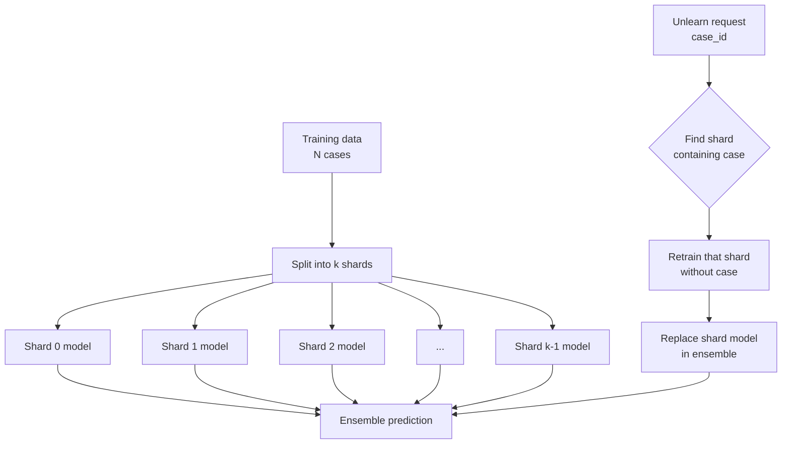

# PV-Signal-ML: Pharmacovigilance Signal Detection Research Prototype

**Research implementation demonstrating signal detection algorithms, ML-based triage, SISA machine unlearning, and regulatory compliance concepts for educational and portfolio purposes.**

---

## ⚠️ IMPORTANT REGULATORY DISCLAIMER

**This is a research/proof-of-concept project, NOT a validated production system.**  

- NOT FDA 21 CFR Part 11 validated (no formal GAMP5 validation performed)  
- NOT for use with real patient data (demonstration on aggregated/public data only)  
- NOT a substitute for commercial PV systems (SAS, Snowflake, validated PV platforms)  
- Educational value: illustrates how enterprise PV systems work algorithmically  
- Portfolio project: showcases signal detection, ML, unlearning, and compliance concepts  

For real-world use, a separate, validated implementation is required. [file:42]

---

## 🎯 What Is This?

`PV_Signal_ML` is a **research prototype** that demonstrates how enterprise pharmacovigilance (PV) systems can implement: [file:42]

- Statistical signal detection (PRR, Chi-square) on aggregated safety data  
- ML-based triage with XGBoost and SHAP explainability  
- RAG-style narrative generation of Signal Assessment Reports (SARs) using a **local** LLM via Ollama  
- GDPR-oriented governance: data lineage, audit logging, and machine unlearning (SISA)  

Status: **RESEARCH PROTOTYPE** (non-production, non-validated).

---

## 🏗️ Enterprise Mapping

| Layer       | Enterprise Standard             | This Prototype                         | Why This Works                                                          |
| ---------- | --------------------------------| -------------------------------------- | ------------------------------------------------------------------------|
| Data Lake  | Snowflake / Databricks          | SQLite + CSV + Parquet                 | Same relational schema and queries; scalability is an infra choice. [file:42] |
| Statistics | SAS / R                         | Python (pandas, numpy, scipy)          | PRR and Chi-square formulas are identical across tools. [file:42]       |
| ML Engine  | SageMaker / Vertex AI           | Local XGBoost + MLflow                 | Algorithm and tracking logic are equivalent; deployment differs. [file:42] |
| Context    | GraphRAG / Neo4j                | Direct Ollama API                      | Provides contextual SAR narratives without graph DB for MVP. [file:42][file:41] |
| UI         | React / Angular                 | Streamlit single-page app (`app_enhanced.py`) | UI shell differs; workflow and logic are the same. [file:41][file:42] |
| Compliance | Full GxP stack                  | Governance docs + lineage + audit logs | Concepts implemented at prototype level for learning. [file:42]         |

---

## 🛠️ Tech Stack

- **Data & Stats:** pandas, numpy, scipy, SQLite, CSV/Parquet [file:41][file:42]  
- **ML & Explainability:** XGBoost, scikit-learn, SHAP, MLflow [file:41][file:42]  
- **Unlearning:** SISA ensemble (sharded XGBoost models) via `SISATrainer` [file:41][file:42]  
- **LLM / RAG:** Direct Ollama API (no LangChain/Chroma) through `SARGenerator` [file:41][file:42]  
- **UI:** Streamlit single-page app (`app_enhanced.py`) with six tabs [file:41]  
- **Compliance Tooling:** data lineage JSONs, GDPR deletion registry, audit logging [file:42]  

---

## 🚀 Quick Start (Local Only)

This project is designed to run **entirely on a local machine**. Ollama and (optionally) MLflow are assumed to be local services. [file:41][file:42]

### Prerequisites

- Python 3.9+  
- Git  
- **Ollama installed locally** with at least one model pulled  
  - Supported model names used in the app: `llama3.2`, `llama3.1`, `mistral`, `mixtral` [file:41]  
- Optional but recommended: MLflow for experiment tracking  
  - URI configured via `config.MLFLOW_TRACKING_URI` [file:41]  

### Installation


```bash
git clone https://github.com/PrashantRGore/PV_Signal_ML.git
python -m venv venv
```

**Windows**

```bash
venv\Scripts\activate
```

**macOS/Linux**

```bash
source venv/bin/activate
```

```bash
pip install -r requirements.txt
```


### Start local services

**Start Ollama (local only)**

```bash
ollama serve
```

**Pull at least one model (one-time)**

```bash
ollama pull llama3.2
```

or

```bash
ollama pull mistral
```

or

```bash
ollama pull mixtral
```

**If using MLflow:**

## Start an MLflow tracking server
### Example: local file-based tracking

```bash
mlflow ui --backend-store-uri mlruns
```

Ensure `config.MLFLOW_TRACKING_URI` points to the URI you want (for example, `http://127.0.0.1:5000` or a local file store path). [file:41]

### Run the Streamlit app

```bash
streamlit run app_enhanced.py
```

Then open `http://localhost:8501` in your browser. [file:41][file:42]

The sidebar will show live **service status**:

- 🟢 / 🔴 **Ollama** status, via `SARGenerator.check_service()`  
- 🟢 / 🔴 **MLflow** status (reachable experiments at `config.MLFLOW_TRACKING_URI`) [file:41]  

---

## 📊 Main App Workflow (`app_enhanced.py`)

Once data is loaded from the sidebar, the app exposes six main tabs. [file:41]

### 1. 🔍 Signal Detection

- Select a data source via `DataSourceManager` (local CSV/Parquet, demo HF dataset, or FAERS-like source). [file:41]  
- Run disproportionality analysis (PRR, Chi-square) using `DisproportionalityAnalysis`.  
- Optionally apply ML-based causality scoring via `CausalityScorer`.  
- Use drug portfolio filtering by uploading an Excel file; `DrugFilter` restricts signals to your portfolio and shows coverage metrics. [file:41]  
- Download filtered signals as CSV. [file:41]  

### 2. 🤖 ML Validation (SISA)

- Enable **SISA** and specify the number of shards. [file:41]  
- Train a sharded ensemble with `SISATrainer`, which returns metrics (AUC, feature names, sample counts). [file:41]  
- Results are stored in session state and can be inspected via an expandable JSON block and model report.  

### 3. 💡 Explainability (SHAP)

- Generates SHAP explanations for the current trained model using `SHAPAnalyzer`. [file:41]  
- Uses the same feature pipeline stored in the trained `SISATrainer` to ensure consistent features.  
- Shows global feature importance plot plus a table of top features and the number of samples used. [file:41]  

### 4. 📝 SAR Reports (RAG)

- Select a top drug–event signal (PRR, case count) and choose an Ollama model. [file:41]  
- `SARGenerator` checks that Ollama and the selected model are available; if not, a helpful “Start Ollama: ollama serve” hint is shown. [file:41]  
- Generates a structured SAR including:  
  - Causality assessment (WHO-UMC, Naranjo, consensus)  
  - Literature evidence summary and sources  
  - Full narrative SAR report text [file:41]  
- Allows downloading a timestamped `.txt` SAR file and clearing the current SAR context. [file:41]  

### 5. 📋 MLflow Tracking

- Connects to MLflow at `config.MLFLOW_TRACKING_URI`. [file:41]  
- Lists all experiments, lets you select one, and then lists runs with metrics/parameters.  
- Shows detailed parameters and metrics for a selected run in JSON form. [file:41]  

### 6. 🗑️ Unlearning (GDPR)

- Uses `SISATrainer.unlearn(case_id)` to support the “right to be forgotten”. [file:41][file:42]  
- For a given case ID, finds the affected shard, retrains only that shard, and updates the ensemble. [file:41][file:42]  
- UI shows model version, active shard count, and detailed unlearning result JSON. [file:41]  

---


🧮 Core Workflows
FAERS ingestion & signal computation: `faers_build_signals.py`

Statistical engine (PRR / Chi-square): `stats_engine.py`

ML triage + MLflow tracking: `pv_signal_ml_pipeline.py`

Explainability (SHAP): `shap_analysis_simple.py` and Tab 3 in `app_enhanced.py`

SAR generation with Ollama: `sar_generator.py` and Tab 4 in `app_enhanced.py`

GDPR deletion registry: `gdpr_deletion_registry.py`

Audit logging: `audit_logging.py`

The main user-facing workflow is through `app_enhanced.py`, which exposes tabs for signal detection, ML validation, explainability, SAR generation, MLflow runs, and SISA unlearning.


## 📁 Project Structure (Simplified)

This is a simplified view of key components; internal modules under `src/` are used heavily by `app_enhanced.py`. [file:41][file:42]

```text
PV_Signal_ML/
├── app_enhanced.py # Main Streamlit app (all tabs, including SISA & SAR)
├── api.py # FastAPI service (optional)
│
├── faers_build_signals.py # FAERS ingestion & signal computation (CLI, optional)
├── stats_engine.py # PRR / Chi-square calculations (legacy/utility)
├── prepare_ml_features.py # Feature engineering for ML pipeline
├── pv_signal_ml_pipeline.py # XGBoost training + MLflow (script)
├── shap_analysis_simple.py # Standalone SHAP analysis script
│
├── sar_generator.py # Legacy SAR script; app uses src/rag/sar_generator instead
├── rag_signal_evidence.py # Evidence retrieval (embeddings + PubMed)
├── signal_report_builder.py # SAR / PSMF formatting helpers
│
├── data_lineage.py # Data lineage and provenance tooling
├── gdpr_deletion_registry.py # Right-to-be-forgotten registry script
├── audit_logging.py # Access/event logging script
├── governance_dpia.md # DPIA and governance notes
├── change_control.py # Predetermined change control plan
│
├── src/
│ ├── data/
│ │ └── data_source_manager.py
│ ├── stats_engine/
│ │ └── disproportionality.py
│ ├── ml/
│ │ ├── sisa_trainer.py
│ │ └── causality_scorer.py
│ ├── explainability/
│ │ └── shap_analysis.py
│ ├── rag/
│ │ └── sar_generator.py
│ └── utils/
│ ├── data_prep.py
│ ├── drug_filter.py
│ └── logger.py
│
├── templates/
│ └── signal_report_template.md
│
├── sar_reports/
│ └── reports/ # Generated SAR markdown/JSON
├── ml_data/ # ML feature matrices
├── lineage/ # Lineage JSONs
├── audit_logs/ # Log files
├── gdpr_registry/ # Deletion registry files
│
├── models/
│ └── sisa/ # SISA shard models (shard_*.pkl)
│
├── Experimental/ # Experimental UIs / notebooks
└── requirements.txt
```

---

## 🧮 Utility Scripts (Optional)

The main user-facing workflow is through `app_enhanced.py`. The following scripts are **optional utilities** that mirror parts of the pipeline. [file:41][file:42]

**ML triage + MLflow tracking pipeline**: 

`pv_signal_ml_pipeline.py`

**GDPR deletion registry demo**

`python gdpr_deletion_registry.py`

**Audit logging demo**
`python audit_logging.py`

**FAERS ingestion & signal computation (example CLI)**
`python faers_build_signals.py 2024-01-01 2024-03-31`

### These can be used as smoke tests or for batch/offline experimentation but are **not required** before running the Streamlit app. [file:42]

---

## 🔐 SISA Machine Unlearning (Tab 6)

SISA (Sharded, Isolated, Sliced, Aggregated) is used to support efficient machine unlearning: removing specific cases from the model without retraining the entire ensemble. [file:41][file:42]

**Implementation:**

- `src/ml/sisa_trainer.py` – `SISATrainer` class with `train(...)` and `unlearn(case_id)`  
- `models/sisa/shard_*.pkl` – one XGBoost model per shard  
- `app_enhanced.py` – Tab 2 (“ML Validation”) for training and Tab 6 (“Machine Unlearning”) for unlearning requests [file:41][file:42]  

**Example usage in code:**

```python
from src.ml.sisa_trainer import SISATrainer

trainer = SISATrainer(model_dir="models/sisa")
results = trainer.train(signals_df, n_shards=10)
print(results["auc"], results["n_shards"])

result = trainer.unlearn(case_id=5432)
print(result)
```

This retrains only the affected shard and updates the ensemble.

---


## ✅ Basic Local Checks

For quick local verification after setup: [file:42]

Optional: run selected scripts
`python pv_signal_ml_pipeline.py`
`python gdpr_deletion_registry.py`
`python audit_logging.py`

Optional: run tests (if test suite present)
`python -m pytest tests/`


# Conceptual flow



Formulas for PRR and Chi-square are aligned with standard pharmacovigilance guidelines, but the system as a whole is **not** validated for regulatory use. [file:42]

---

## 📚 References

Conceptually aligned with: [file:42]

- EMA GVP Module IX (Signal Management)  
- CIOMS XIV (Practical Aspects of Signal Detection)  
- Standard PRR / Chi-square disproportionality methods  
- XGBoost and SHAP documentation for ML and explainability
